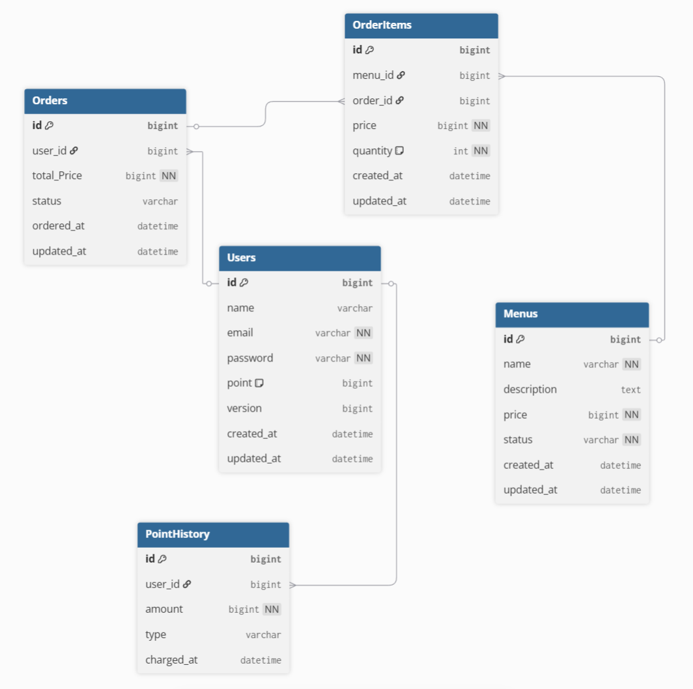

# 커피 주문 시스템 (포인트 기반)

포인트 결제 기반의 카페 주문 서비스(백엔드 API)입니다.

## 1. 설계 내용

### 1.1 ERD (DBML)



```dbml
Table Users {
  id bigint [pk, increment]
  name varchar
  email varchar [unique, not null]
  password varchar [not null]
  point bigint [default: 0]
  version bigint
  created_at datetime
  updated_at datetime
}

Table PointHistory {
  id bigint [pk, increment]
  user_id bigint
  amount bigint [not null]
  type varchar
  charged_at datetime
}

Table Menus {
  id bigint [pk, increment]
  name varchar [not null]
  description text
  price bigint [not null]
  status varchar [not null]
  created_at datetime
  updated_at datetime
}

Table OrderItems {
  id bigint [pk, increment]
  menu_id bigint
  order_id bigint
  price bigint [not null]
  quantity int [not null, default: 1]
  created_at datetime
  updated_at datetime
}

Table Orders {
  id bigint [pk, increment]
  user_id bigint
  total_Price bigint [not null]
  status varchar
  created_at datetime
  updated_at datetime
}

Ref: "Orders"."user_id" > "Users"."id"
Ref: "PointHistory"."user_id" > "Users"."id"
Ref: "OrderItems"."order_id" > "Orders"."id"
Ref: "OrderItems"."menu_id" > "Menus"."id"
```

### 1.2 API 명세서

Postman URL : https://documenter.getpostman.com/view/48172004/2sBXVhCAD2

- **회원가입**: `POST /api/auth/register`
- **로그인**: `POST /api/auth/login`
- **포인트 충전**: `POST /api/me/points/charge`
- **전체 메뉴 조회**: `GET /api/menus/coffee`
- **인기 메뉴 TOP 3 조회**: `GET /api/menus/top3`
- **주문 생성 및 결제**: `POST /api/orders`

---

## 2. 설계의 의도

프로젝트는 확장성을 고려해서 **API 경로를 명명**하고,
책임 분리를 위해 **계층 간 역할을 명확히 분리**하는 것을 핵심 의도로 설계되었습니다.

- **Auth와 User 기능 분리**: 인증(회원가입, 로그인)과 관련된 책임은 `AuthService`에, 사용자 정보 관리 책임은 `UsersService`에 부여하여 단일
  책임 원칙을 준수했습니다.

- **DTO 활용**: 3 Layer Architecture를 유지하기 위해 API의 요청과 응답으로 DTO를 사용했습니다.

- **이벤트 기반 아키텍처 (Kafka)**: '인기 메뉴 랭킹 집계' 로직을 Kafka를 통해 구현했습니다.
  `OrderService`는 주문 완료 후 `order-received` 이벤트를 발행하고, 사용자에게 응답을 전달합니다. 전달된 이벤트(메시지)는 Kafka의
  `order-received` 토픽으로 입력되며, Redis에서 이 이벤트 정보를 통해 각 메뉴의 주문량을 Score로 기록합니다. 기록된 Score는 커피 메뉴 Top3 조회
  요청 시 큰 순서대로 1~3위까지 조회됩니다.

---

## 3. 선택한 문제해결 전략 및 분석 내용

### 3.1 동시성 제어 (Concurrency Control)

- **문제 상황**: 여러 사용자의 주문 요청이 거의 동시에 발생할 경우, 한 명의 사용자의 포인트가 이중으로 차감되거나, 주문하는 순간 메뉴 가격이 변경되어 계산이 잘못될 수
  있는 문제가 있었습니다.
- **분석 내용**: 데이터베이스에 Lock을 거는 `비관적 락`과, 버전 정보를 활용하는 `낙관적 락`의 장단점을 비교 분석했습니다. `비관적 락`은 데이터 정합성을 확실히
  보장하지만 성능 저하의 우려가 있고, `낙관적 락`은 성능은 좋지만 충돌 시 재처리 로직이 필요했습니다.
- **선택한 전략 (하이브리드 방식)**:
    1. **사용자 포인트**: 충돌 빈도가 낮을 것으로 예상되는 사용자 포인트 변경에는 **낙관적 락 (`@Version`)**을 적용하여 높은 처리량을 확보했습니다.
    2. **메뉴 가격**: 주문 트랜잭션 동안 가격이 변경되는 것을 막기 위해, 메뉴 조회 시 **비관적 읽기 락 (`PESSIMISTIC_READ`)**을 적용했습니다.
       이를 통해 데이터 정합성을 보장하면서도 다른 사용자의 메뉴 조회를 막지 않도록 해 성능 저하를 최소화했습니다.

### 3.2 Kafka 메시지 처리 구조

- **문제 상황**:
    * 주문이 완료될 때마다 '인기 메뉴' 순위를 업데이트해야 했습니다.
    * 주문을 처리하면서 동시에 순위까지 계산하면, 주문이 완료되기까지 시간과 처리 비용이 크기 때문에 개선이 필요했습니다.

- **분석 내용**:
    * 주문 기능과 랭킹 기능은 서로 직접적으로 연결될 필요가 없다고 판단했습니다. '주문이 들어왔다'는 사실만 알려주면, 랭킹 계산은 나중에 따로 할 수 있기 때문입니다.
    * 이 '알림' 역할을 해줄 수 있는 기술로 강의에서 배운 Kafka를 사용해보기로 했습니다.

- **선택한 전략 (Kafka로 작업 분리하기)**:
    1. **`OrderService`가 Kafka에 메시지 보내기**
        - 사용자가 주문을 하면, `OrderService`는 주문을 먼저 완료시킵니다.
        - 그 다음, '어떤 메뉴가 몇 개 팔렸다'는 정보가 담긴 메시지(`OrderEvent`)를 만들어서 Kafka의 `order-received`라는 통로(토픽)로
          보냅니다.
        - 사용자에게 주문이 완료되었다고 응답합니다.

    2. **별도의 리스너가 메시지 받아서 처리하기**
        - 새로운 주문 메시지가 들어오면, `OrderEventListener`가 메시지를 받아 내용을 확인합니다.
        - 확인된 "메뉴 ID와 수량" 정보를 `MenuRankingService`에게 넘겨주어 Score를 올려달라고 요청합니다.

    3. **Redis에 점수 올리기**
        - `MenuRankingService`는 넘겨받은 메뉴 ID와 수량만큼 Redis에 있는 Score를 올려줍니다.
        - 이 과정을 `MenuRankingScheduler`가 3분마다 업데이트합니다.

---

## 4. 기술적 선택 이유

- **Kafka**: '인기 메뉴 랭킹' 기능을 위해 도입했습니다. 주문 처리와 랭킹 집계를 **비동기 방식**으로 처리하고 두 로직을 분리하기
  위함입니다. 이를 통해 주문 API의 응답 속도를 향상시키고, 향후 '알림 발송', '재고 관리' 등 주문 이벤트에 반응하는 다른 기능들을 `OrderService` 수정 없이
  손쉽게 추가할 수 있는 확장성을 확보했습니다.

- **Redis (Sorted Set)**: 실시간 랭킹 집계로 `ZSET`을 활용해 정렬된 값을 빠르고 효율적으로 Top 3 메뉴를 조회할 수 있습니다.

- **Docker (`docker-compose`)**: 로컬 개발 환경에서 `Kafka`, `Redis`를 관리하기 위해 사용했습니다. IDE에서 애플리케이션과 DB(
  MySQL)를 사용하고, Docker에서 인프라(Kafka, Redis)를 실행하는 구조입니다.